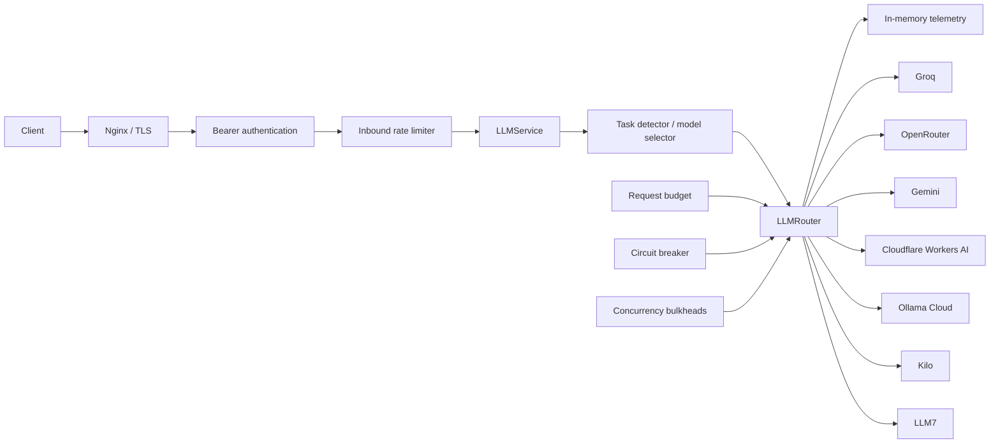

# AI Core

[](https://github.com/elmirbek-ai/ai-core/actions/workflows/ci.yml)


A production-oriented multi-provider LLM gateway built with FastAPI.

AI Core sits between client applications and external LLM providers. It resolves
the requested task, selects an appropriate model and provider chain, and falls
back on recoverable upstream failures without exposing provider-specific APIs to
clients.

The gateway combines request-level deadlines, circuit breaking, per-provider
concurrency limits, inbound rate limiting, and process-local telemetry. It
supports authenticated non-streaming and SSE APIs, deterministic local task
detection, and HTTPS image-URL messages.

## Documentation

- [Architecture](docs/ARCHITECTURE.md) — current system, target system, principles, and boundaries
- [Roadmap](docs/ROADMAP.md) — governed Phase 0–15 development sequence
- [Architecture Decision Records](docs/adr/) — accepted decisions and consequences

## Architecture



Provider clients are created once during the FastAPI lifespan and closed during
shutdown. API, routing, and provider responsibilities remain separated.

## Features

| Capability | Status |
|---|---|
| Multi-provider task and model routing | Implemented |
| Deterministic automatic task detection | Implemented |
| Recoverable provider fallback | Implemented |
| Circuit breaker and cooldown | Implemented |
| Task-specific total request budgets | Implemented |
| Per-provider concurrency bulkheads | Implemented |
| Server-Sent Events streaming | Implemented |
| Multimodal HTTPS `image_url` messages | Implemented |
| Bearer client authentication | Implemented |
| Inbound token-bucket rate limiting | Implemented |
| Bounded in-memory telemetry | Implemented |
| Docker and Docker Compose deployment | Implemented |
| Nginx HTTPS reverse-proxy baseline | Implemented |
| GitHub Actions quality gate | Implemented |
| Deterministic resilience benchmark | Implemented |

## Supported tasks

| Task | Purpose |
|---|---|
| `general` | General text requests |
| `fast` | Low-latency text requests |
| `reasoning` | Deeper analysis and multi-step reasoning |
| `code` | Code generation, review, and debugging |
| `summarize` | Text summarization |
| `translate` | Translation |
| `classify` | Classification and categorization |
| `extract` | Structured information extraction |
| `auto` | Deterministic local intent detection |
| `multimodal` | Text plus HTTPS image-URL input |
| `long_context` | Explicit long-context routing |

`auto` uses local rules only—no classifier model or external request. It detects
English, Russian, and Kyrgyz intent and falls back conservatively to `general`.
Explicit task values are never overridden.

## Providers

| Provider | Text | Images | Streaming | Default policy |
|---|:---:|:---:|:---:|---|
| Groq | Yes | No | Yes | Required primary provider |
| OpenRouter | Yes | Configurable; off by default | Yes | Optional fallback |
| Gemini | Yes | Yes | Yes | Optional; multimodal and long-context role |
| Cloudflare Workers AI | Yes | No | Yes | Optional fallback |
| Ollama Cloud | Yes | No | No | Optional fallback |
| Kilo | Yes | No | No | Optional; explicit opt-in |
| LLM7 | Yes | No | Yes | Optional; explicit opt-in |

Optional providers without the required configuration are not created and are
skipped by routing. Image payloads are sent only to providers explicitly marked
image-capable.

## Routing overview

| Task group | Provider order |
|---|---|
| Standard (`general`, `fast`, `summarize`, `translate`, `classify`, `extract`, `auto`) | Groq → OpenRouter → Cloudflare → Ollama → Kilo → LLM7 |
| Reasoning | Groq → Cloudflare → Ollama → OpenRouter → LLM7 |
| Code | Groq → Cloudflare → Ollama → OpenRouter → Kilo → LLM7 |
| Long context | Gemini → OpenRouter → Kilo → Cloudflare → Ollama → Groq |
| Multimodal with an image | Gemini → OpenRouter, only when OpenRouter image support is explicitly enabled |

Rate-limit, timeout, connection, and upstream failures are recoverable. Provider
authentication and other non-recoverable errors stop the chain. Circuit-open,
disabled, or capability-incompatible providers are skipped without an upstream
attempt.

## Quick start

### 1. Clone and create an environment

```bash
git clone https://github.com/elmirbek-ai/ai-core.git
cd ai-core
python -m venv .venv
```

Activate it on Linux or macOS:

```bash
source .venv/bin/activate
```

Activate it on Windows:

```powershell
.venv\Scripts\activate
```

Install development and test dependencies:

```bash
python -m pip install -r requirements-dev.txt
```

### 2. Create local configuration

Linux or macOS:

```bash
cp .env.example .env
```

Windows:

```powershell
copy .env.example .env
```

The minimum configuration is:

```dotenv
AI_CORE_API_KEY=strong-random-secret
GROQ_API_KEY=your-groq-api-key
```

These values are placeholders. Generate a strong, independent client key and
use a real Groq credential only in your local/runtime `.env`. See
[`.env.example`](.env.example) for optional providers and operational settings.

### 3. Run locally

Development with reload:

```bash
uvicorn app.main:app --reload
```

Production-compatible runtime:

```bash
uvicorn app.main:app --host 0.0.0.0 --port 8000 --workers 1
```

The supported production policy is one process with one worker because circuit,
telemetry, rate-limit, and concurrency state is currently process-local.

## API usage

### Non-streaming chat

```bash
curl --fail-with-body \
  -H "Authorization: Bearer ${AI_CORE_API_KEY}" \
  -H "Content-Type: application/json" \
  -d '{"task":"general","messages":[{"role":"user","content":"What is FastAPI?"}]}' \
  http://127.0.0.1:8000/v1/chat
```

The response contract is provider-independent:

```json
{
  "provider": "provider-name",
  "model": "model-name",
  "content": "generated response"
}
```

### Automatic task detection

```json
{
  "task": "auto",
  "messages": [
    {
      "role": "user",
      "content": "Бул Python коддогу катаны оңдо"
    }
  ]
}
```

The local detector resolves this intent to `code`; the existing code routing
chain then handles the request.

### Streaming chat

```bash
curl --no-buffer --fail-with-body \
  -H "Authorization: Bearer ${AI_CORE_API_KEY}" \
  -H "Content-Type: application/json" \
  -d '{"task":"general","messages":[{"role":"user","content":"Explain FastAPI briefly."}]}' \
  http://127.0.0.1:8000/v1/chat/stream
```

The authenticated endpoint emits JSON-encoded SSE events: `meta`, `delta`,
`done`, and `error`. A recoverable pre-token failure may fall back to another
streaming provider. Once a delta is emitted, providers are never mixed.

### Multimodal chat

```json
{
  "task": "auto",
  "messages": [
    {
      "role": "user",
      "content": [
        {"type": "text", "text": "Describe this image briefly."},
        {
          "type": "image_url",
          "image_url": {"url": "https://example.com/image.jpg"}
        }
      ]
    }
  ]
}
```

Image URLs must use HTTPS. AI Core passes the URL to an eligible provider and
does not download the image itself. Base64 data, multipart uploads, local files,
and image storage are not supported.

## Authentication

AI Core client authentication is separate from every provider credential.

Protected endpoints:

- `POST /v1/chat`
- `POST /v1/chat/stream`

Public operational and documentation endpoints:

- `GET /health`
- `GET /docs`
- `GET /redoc`
- `GET /openapi.json`

Missing, malformed, or incorrect Bearer credentials return HTTP 401 before any
rate-limit state, request budget, provider client, or stream is used.

## Inbound rate limiting

The default process-local limits are:

- 60 authenticated requests per minute
- Burst capacity of 10 requests
- 4 active streaming connections

The token bucket is checked after authentication and before inference. Rejected
requests return HTTP 429 with `Retry-After`. Provider-side rate limits and
provider concurrency bulkheads remain separate concerns.

## Health

```bash
curl --fail http://127.0.0.1:8000/health
```

Example response:

```json
{
  "status": "ok",
  "service": "AI Core",
  "version": "0.1.0"
}
```

The endpoint does not call providers or expose provider state, models,
telemetry, rate limits, or credentials.

## Docker and production deployment

Local Docker Compose publishes AI Core directly on port 8000:

```bash
docker compose up --build
```

The production Compose configuration places AI Core behind Nginx:

```bash
docker compose -f compose.prod.yaml up --build -d
```

Production requires runtime environment configuration, DNS, and a trusted TLS
certificate. Nginx terminates TLS on ports 80/443 and reaches AI Core on the
internal Docker network at port 8000. Port 8000 must not be exposed publicly.

The baseline disables SSE buffering, limits JSON request bodies to 2 MiB, and
uses finite 120-second proxy timeouts. See [DEPLOYMENT.md](DEPLOYMENT.md) for
certificate paths, firewall guidance, health verification, and shutdown steps.

## Testing

The current test suite contains **484 passing tests**.

```bash
python -m pytest -q -p no:cacheprovider
python -m compileall -q app tests benchmarks groq_smoke.py
pip check
```

Unit and integration tests use mocks and do not require live provider requests.

## Resilience benchmark

Run the deterministic, network-free benchmark:

```bash
python -m benchmarks.resilience
```

Live provider smoke mode is explicit:

```bash
python -m benchmarks.resilience --real
```

Real mode consumes configured provider credentials and may consume quota or hit
upstream capacity limits. It is not run by CI.

## Continuous integration

GitHub Actions runs on pushes and pull requests targeting `master`. The quality
gate performs:

- Python compilation
- The full pytest suite
- Dependency consistency checks
- Docker build and Compose validation
- Nginx syntax validation with a temporary certificate
- An isolated container health/authentication smoke test

CI does not make real LLM provider requests and does not require provider
secrets.

## Security notes

- Never commit `.env`, API keys, access tokens, account IDs, or credentials.
- [`.env.example`](.env.example) contains names and safe placeholders only.
- TLS certificates and private keys are ignored by Git.
- Upstream errors are mapped to sanitized domain and HTTP errors.
- Telemetry stores counters, categories, and timing—not prompts or responses.
- Use the Nginx baseline before exposing the service publicly.
- Keep AI Core port 8000 private in production.

## Current limitations

- Production is intentionally limited to one process and one worker.
- Telemetry, circuits, rate limits, and concurrency state are process-local.
- Horizontal scaling and distributed/global rate limiting are not implemented.
- Client authentication currently uses one shared AI Core key.
- There is no database, user-account system, JWT/OAuth flow, or billing layer.
- Embeddings are not implemented.
- Ollama and Kilo streaming are not implemented.
- Gemini upstream availability and latency may vary independently of AI Core.

## Project structure

```text
app/
  api/                 HTTP endpoints
  core/                Settings, authentication, inbound rate limiting
  llm/
    providers/         Provider adapters
    router.py          Provider chains and fallback execution
    health.py          Circuit breaker and cooldown
    telemetry.py       In-memory metrics
  schemas/             Pydantic API schemas
  services/            Application orchestration
tests/                  Unit and integration tests
benchmarks/             Deterministic resilience tooling
deploy/nginx/           Production reverse-proxy configuration
.github/workflows/      CI quality gate
```

## Development status

**Status:** Active development.

The current deployment baseline is suitable for a single-worker production
instance. Scaling beyond one process requires distributed coordination for
health, telemetry, inbound rate limiting, and concurrency controls.

## Maintainer

Maintained by Elmirbek Toktoraliev — GitHub: [elmirbek-ai](https://github.com/elmirbek-ai)
