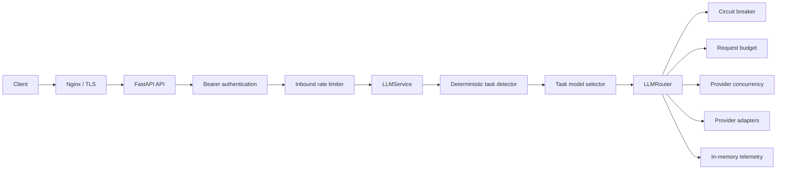

# AI Core Architecture

## Document status

- Scope: architecture baseline and target direction
- Phase: Phase 0 — Architecture Freeze
- Current phase status: **IN PROGRESS** until these documents are reviewed and committed
- Runtime baseline: Python 3.12, FastAPI, one process, one worker

This document deliberately separates what exists today from what is planned.
Sections labelled **Current** describe implemented and tested behavior. Sections
labelled **Target** describe future architecture and must not be interpreted as
available functionality.

## Architecture principles

1. **Provider agnostic.** Public APIs and application services do not depend on
   a specific provider SDK.
2. **Capability driven.** A provider/model is eligible only when its declared
   capabilities match the request.
3. **Measurable over subjective.** Quality, reliability, latency, and cost
   decisions require comparable evidence.
4. **Graceful degradation.** Recoverable upstream failures may use a safe,
   ordered fallback.
5. **Explicit failure semantics.** Authentication, rate limits, timeouts,
   upstream failures, and non-recoverable provider errors remain distinct.
6. **Secure by default.** Authentication precedes inference, secrets are never
   logged, and upstream errors are sanitized.
7. **Backward-compatible API evolution.** Breaking changes require explicit,
   documented approval.
8. **Deterministic and explainable routing first.** Adaptive behavior starts
   with rules and measurable scores, not an opaque ML router.
9. **Distributed complexity only when justified.** In-memory state remains a
   valid choice for local and single-worker deployments.
10. **Evaluation before optimization.** Provider admission and routing changes
    follow controlled evaluation rather than anecdotal results.
11. **Permanent zero-cost only.** A provider/model must pass the zero-cost gate
    before future adapter implementation and live use. No required payment
    method, paid balance, trial-credit-only eligibility or automatic overage.
    Free-quota exhaustion must fail closed. See
    [ZERO_COST_POLICY.md](providers/ZERO_COST_POLICY.md).

---

## Current architecture

### Current scope

AI Core is a provider-agnostic FastAPI LLM gateway with seven provider adapters:

1. Groq
2. OpenRouter
3. Gemini
4. Cloudflare Workers AI
5. Ollama Cloud
6. Kilo
7. LLM7

Adapter presence is not live eligibility. Phase 5 retains the tested rejected
OpenAI Responses adapter as an archived implementation. Registry/model guards
exclude rejected or unverified configurations before routing; hosted Ollama and
historical Kilo defaults currently lack required free-model evidence. Cloudflare
and LLM7 require operator-confirmed non-billable free modes. Existing task-chain
order and public API contracts remain unchanged.

The implemented request path is:



Phase 3 adds a pure ASGI correlation/latency boundary, structured application
JSON logs and lifespan-owned HTTP aggregates. Provider metrics remain in
`LLMTelemetry`; stream TTFT uses the selected provider attempt. See
[OBSERVABILITY.md](OBSERVABILITY.md) for schemas, security boundaries and metric
definitions. There is no public metrics endpoint. Phase status is governed by
[ROADMAP.md](ROADMAP.md).

Phase 4 provides repository-local evaluation tools under `app/evaluation/`,
versioned datasets and synthetic fixtures under `evals/`, and compatible JSON/
Markdown evidence reports. Evaluation is separate from production inference;
existing-provider live runs require explicit dual opt-in. See
[EVALUATION.md](EVALUATION.md) for scoring, provenance, privacy and limitations.
Phase 4 is complete; Phase 5 admission follows the mandatory zero-cost gate.

### Current public API

Protected with the AI Core Bearer credential:

- `POST /v1/chat`
- `POST /v1/chat/stream`

Public:

- `GET /health`
- `GET /docs`
- `GET /redoc`
- `GET /openapi.json`

The non-streaming response contract is provider independent:

```json
{
  "provider": "provider-name",
  "model": "model-name",
  "content": "generated response"
}
```

### Current request orchestration

- Explicit tasks remain authoritative.
- `auto` uses deterministic English, Russian, and Kyrgyz rules; it makes no
  classifier-model or external request.
- Task routing selects Groq fast or reasoning models and an ordered provider
  chain.
- Recoverable rate-limit, timeout, connection, and upstream failures may fall
  back. Authentication and non-recoverable provider failures are terminal.
- Image messages use HTTPS `image_url` parts and are restricted to explicitly
  image-capable providers.
- Streaming may fall back before the first visible delta. It never mixes
  providers after a delta has been emitted.

### Current resilience controls

- Task-specific total request budgets
- Process-local provider health state, circuit breaker, and cooldown
- Per-provider concurrency semaphores
- Reusable provider clients with lifespan-managed shutdown
- Process-local token-bucket inbound rate limiting
- Active stream connection limits
- In-memory aggregate telemetry without prompt or response storage

### Current deployment model

- Docker and Docker Compose
- Nginx TLS reverse-proxy baseline
- AI Core port 8000 is internal in the production Compose configuration
- One process and one Uvicorn worker
- GitHub Actions compile, test, dependency, Docker, Compose, Nginx, and
  container-smoke quality gates
- 484 passing tests at the Phase 0 baseline

### Current state ownership

The following state is process-local:

- Provider health and circuit state
- Telemetry counters and latency aggregates
- Provider concurrency semaphores
- Inbound token bucket and active stream count

Multiple workers would create independent copies and multiply effective limits.
The supported current production policy is therefore one process / one worker.

---

## Target architecture

> **Not implemented:** Everything in this section is a design target governed
> by [ROADMAP.md](ROADMAP.md) and future ADRs.

AI Core is intended to evolve from a deterministic multi-provider gateway into
an intelligent, measurable LLM orchestration engine.

```mermaid
flowchart LR
    Client --> Nginx[Nginx]
    Nginx --> API[FastAPI API]
    API --> Auth[Bearer auth]
    Auth --> RequestID[Request ID]
    RequestID --> Limit[Rate limiter]
    Limit --> Analyzer[Request analyzer]
    Analyzer --> Policy[Policy engine]
    Policy --> Cache[Semantic cache]
    Cache --> Router[Adaptive router]
    Router --> Candidate[Provider + model]
    Candidate --> Processing[Response processing]
    Processing --> Observe[Telemetry / evaluation]
    Observe --> Client
```



### Target request analyzer

Future `RequestAnalysis` should conceptually determine:

- Task
- Language
- Complexity
- Context size
- Modality
- Required capabilities
- Whether reasoning is required
- Whether code capability is required
- Freshness sensitivity

Its first implementation must be deterministic, testable, and conservative.
The data contract and thresholds are not frozen by this document.

### Target policy engine

The target policy choices are:

| Policy | Intent |
|---|---|
| `QUALITY` | Prefer quality, then latency and cost |
| `BALANCED` | Balance quality, reliability, latency, and cost |
| `FAST` | Prefer latency while enforcing a minimum quality threshold |
| `CHEAP` | Prefer cost while enforcing a minimum quality threshold |

`BALANCED` is the target default. Exact weights and thresholds are explicitly
not frozen; they must be derived from evaluation data.

### Target provider and model representation

Routing operates on a **provider + model candidate**, not only a provider.
Candidate roles may include:

- Fast
- General
- Reasoning
- Code
- Long context
- Multimodal

Not every provider or model must implement every role. Declared and tested
capabilities determine eligibility.

Potential provider candidates, in evaluation order, are OpenAI direct,
DeepSeek direct, Mistral direct, Anthropic direct, and xAI direct. They are not
approved providers. Admission requires the pipeline below:

```text
ZERO-COST GATE (reject paid/unverified before implementation)
  -> Adapter
  -> Contract tests
  -> Security tests
  -> Capability tests
  -> Latency benchmark
  -> Quality evaluation
  -> Cost evaluation
  -> Routing admission decision
```

If a provider/model does not measurably improve a relevant workload, it is not
added to production routing.

### Target adaptive router

The planned deterministic pipeline is:

1. Candidate generation
2. Capability filtering
3. Provider health filtering
4. Request-budget filtering
5. Task-fit scoring
6. Quality scoring
7. Latency scoring
8. Reliability scoring
9. Cost scoring
10. Best-candidate selection
11. Ordered fallback candidates

The first adaptive router must be explainable and reproducible in tests. An
ML-based router may be considered only after sufficient evaluation data exists
and a separate architecture decision approves it.

### Target evaluation system

An evaluation framework is mandatory before provider expansion. It must produce
comparable provider/model reports across:

- General
- Reasoning
- Code
- Kyrgyz, Russian, and English
- Translation
- Summarization
- Extraction
- Long context
- Multimodal

Metrics may include quality, accuracy, instruction following, reasoning
quality, hallucination rate, formatting correctness, latency, time to first
token, failure rate, and cost. Dataset versioning, runner reproducibility, and
report comparability are required before routing decisions use these results.

### Target semantic cache

Semantic caching belongs to Phase 10 and is not currently implemented.
Potential conservative candidates include static factual general requests,
translation, and simple explanations.

The cache should bypass freshness-sensitive, personalized, or sensitive input;
complex reasoning; code debugging; and multimodal requests. A cache hit must
never weaken authentication, data isolation, or response correctness.

### Target telemetry

Future request telemetry may include:

- `request_id`
- Task, language, and complexity
- Selected provider and model
- Policy
- Latency and TTFT
- Fallback depth
- Success and sanitized error category
- Cache-hit status

Telemetry must never store prompt content, response content, API keys, Bearer
credentials, provider secrets, or raw upstream error bodies.

### Target state architecture

```text
StateBackend
  |- InMemoryBackend
  `- RedisBackend
```

Potential Redis-backed state includes inbound rate limiting, provider health,
circuit state, semantic cache, and distributed counters. `InMemoryBackend`
remains valid for local and single-worker deployments. Redis is introduced only
when multi-worker or multi-instance requirements justify it.

## Non-goals

The roadmap does not automatically include:

- A user-account system
- Billing
- An OAuth platform
- A database without a demonstrated state requirement
- Arbitrary growth in provider count
- ML-based routing before evaluation data exists
- Kubernetes before operational need
- Microservices without demonstrated need

Any of these may be reconsidered through a future ADR with explicit context,
trade-offs, and evidence.

## Architecture governance

- [Roadmap](ROADMAP.md)
- [ADR 0001 — Core Architecture](adr/0001-core-architecture.md)
- [ADR 0002 — Provider and Model Routing](adr/0002-provider-routing.md)
- [ADR 0003 — Single Worker Production Policy](adr/0003-single-worker-policy.md)
- [ADR 0004 — Evaluation Before Provider Admission](adr/0004-evaluation-before-provider-admission.md)

Architecture changes that conflict with accepted ADRs require a superseding ADR.
