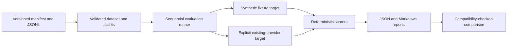

# Evaluation framework

Phase 4 is **IN PROGRESS** pending review, commit and CI. The framework provides
versioned, deterministic offline evidence collection. It does not add providers,
change routing, admit candidates, expose an API, or alter production inference,
authentication, rate limits, budgets, circuits, concurrency or observability.
It uses stdlib and the existing Pydantic dependency; there are no new runtime
dependencies, remote judges, database or third-party evaluation services.

## Architecture and data flow



`app/evaluation/models.py` defines validated cases, scorers, outcomes, provenance
and reports. `loader.py` owns canonical hashing and asset expansion; `scoring.py`
owns deterministic checks; `targets.py` wraps fixtures and existing providers;
`runner.py` owns ordering, measurement, timeouts and cleanup; `pricing.py` handles
optional usage/price evidence; `reporting.py` aggregates and compares; `cli.py`
provides an offline-first command-line interface. Production startup does not
import this package. Existing resilience benchmarks remain separate.

Default dataset, fixture and output paths resolve against this source checkout,
using module location rather than the current working directory. These are
repository tools; versioned datasets are outside the production Python package.

## Dataset v1

`evals/datasets/v1/manifest.json` declares schema version `1`, dataset version
`1.0.0`, creation metadata, domain files, supported languages, total case count,
explicit composite-quality weights and a SHA-256 content checksum.

There are **29 cases** across 11 domains:

| Domain | Cases | Main checks |
|---|---:|---|
| general | 3 | Known answers, classification and requested output constraints |
| reasoning | 3 | Final numeric/categorical answers |
| code | 3 | Python syntax, symbols, snippets and code-only constraints |
| kyrgyz | 2 | Kyrgyz answers and required words |
| russian | 2 | Russian answers and required words |
| english | 2 | English word forms |
| translation | 4 | en→ky, ru→ky, ky→en, ky→ru reference overlap |
| summarization | 3 | Supported facts, forbidden claims and length |
| extraction | 3 | JSON keys, typed values and JSON-only output |
| long_context | 2 | Fact retrieval and instruction retention across a 240-record archive |
| multimodal | 2 | Shape/count answers from explicitly mapped images |

Languages are `ky`, `ru`, `en`. Language grouping refers to the requested output
language, including translation. Translation tags declare source/target pairs.
All cases and the archive are small synthetic author-created examples, not a
representative benchmark or grounds for broad provider-quality claims.

### Case schema

Each JSONL object contains a stable unique `id`, known `domain`/`language`,
existing `task`, ChatRequest-compatible `messages`, nonempty `scorers`, positive
finite `weight`, bounded tags, capability `requirements` and optional
`text_assets`. Expected values live in individual scorer configs. Unknown top
level metadata/scorers/domains, unsupported manifest versions, duplicate IDs,
bad weights/messages, impossible scorer configs, mismatched counts/languages
or checksums are rejected. Every scorer metric must have a declared quality
weight. A file's cases must match its manifest domain.
Required terms must not be whitespace-only; required Python symbols must be
unique valid identifiers rather than keywords.

Text asset references identify a relative path, message index and named
`{{asset:name}}` placeholder. Paths must resolve inside the dataset root;
absolute paths, traversal and escaping symlinks are refused. Validated text is
cached at load, preventing file edits after hashing from changing run input.
Messages are detached copies when expanded; assets are never fetched remotely.

### Hashing and immutable versions

The content hash covers canonical manifest JSON excluding `content_hash`, cases
sorted by `(domain, id)` with their validated fields/defaults, and declared
asset path→SHA-256 mappings. Canonical JSON uses sorted keys, compact separators,
UTF-8 and no nonfinite numbers. Asset text uses UTF-8 with LF line endings, so
Git CRLF/LF checkout differences do not alter evidence. JSON indentation/key
order, domain-file enumeration order and JSONL case order do not change the hash.
Prompt/scorer/weight/asset changes do. Only referenced assets are included.

Published dataset versions should be immutable. Author changes in a new version,
recompute the canonical checksum with `dataset_hash`, validate it, and bind new
fixture profiles to the new version/hash. A separate scorer configuration hash
covers case scorer configs and composite weights. No Python hash randomization
or working-directory-dependent paths are used.

## Scorers and score meanings

All scorer values are between `0.0` and `1.0`. Normalization uses Unicode NFKC,
casefolding and whitespace collapse. Punctuation is retained for exact checks.

| Scorer | Semantics |
|---|---|
| `exact` | Normalized exact match |
| `required_terms` | Fraction of required normalized substrings found |
| `forbidden_terms` | 1 when no forbidden substring appears; otherwise 0 |
| `numeric` | Entire output parses as a finite numeric final answer within explicit absolute tolerance |
| `json` | Valid JSON object; fraction of expected keys with recursively type-equal values; extra keys allowed |
| `format` | JSON, Python syntax, one nonempty line or nonempty `- ` bullet lines |
| `overlap_f1` | Unicode word-token multiset F1 against a reference |
| `python_syntax` | `ast.parse` succeeds and requested function/class symbols are present |
| `grounded_facts` | Required supported-fact substring coverage |
| `forbidden_claims` | Absence of dataset-defined unsupported-claim substrings |
| `length` | Unicode word count within explicit min/max bounds |

Malformed JSON/code/numbers score zero rather than crash. Duplicate JSON keys
and nonfinite JSON numbers are rejected. JSON bool/int/float
are distinct for expected value checks. Code is parsed only: generated code,
imports and shell commands are never executed. Syntax/symbol/snippet checks do
not prove functional correctness or code security.

Each scorer declares a metric (`accuracy_score`, `instruction_following_score`,
`reasoning_score`, `formatting_score`, `groundedness_score`) and a positive weight.
Within a case, a metric is its weighted mean of applicable scorers. Composite
`quality_score` is the weighted mean of available metric values using explicit
manifest `quality_weights`. V1 declares equal weight `1.0` for each of the five
metrics; unavailable metrics are excluded from numerator and denominator.
No missing metric, failed output or skipped case is silently scored as zero.

Report metric values are null when not applicable/unavailable. Quality averages
use successful applicable outputs and case weights; repetitions repeat those
weights. Always inspect reliability and capability coverage with quality:
omitting failed/skipped cases can improve an apparent score mean. Comparisons
also expose paired quality differences on common successful applicable cases.

Reasoning checks score observable final answers only. No private chain-of-thought
is requested, collected or scored. Groundedness and hallucination metrics apply
only to cases with declared evidence/forbidden-claim checks. `hallucination_flag`
is true when any forbidden claim is found; aggregate rate is the proportion of
flagged successful applicable outputs. These are lexical proxies, not semantic
truth detection. Reference overlap likewise cannot perfectly measure translation
or paraphrase quality. Summaries use multiple fact/claim/length checks rather
than exact-reference-summary matching alone.

## Runner and performance

Runs are sequential and sorted deterministically: repetition number first,
then dataset `(domain, id)` order. `--repetitions` supports 1–100. Each attempt
has an explicit timeout (default 60 seconds) and output character limit (default
100,000; maximum 2,000,000). Streaming output is kept only in bounded memory for
scoring; there are no token timing arrays, token logs or response persistence.

Latency uses `time.monotonic()` at the evaluation attempt boundary through target
completion/output collection. Non-stream TTFT is null. Stream TTFT is time to the
first nonempty chunk; empty chunks can carry final usage but do not start TTFT.
No-content streams fail with `empty_stream`. Capability-incompatible cases are
`skipped`, not failures. Attempted = successes + failures; failure rate is
failures/attempted, null when there are no attempts. Latency includes failed
attempts; TTFT includes attempts that produced content even if they later failed.
Scoring means exclude failed outputs, including partial streams.

Case outcomes include safe IDs, target, scores, output length, timing, usage
availability, status and categorical errors. Errors include current provider
domain categories plus `invalid_output`, `output_limit`, `empty_stream` and
synthetic `fixture_failure`. No raw exception text is copied. Cancellation aborts
the run, closes active async generators and target-owned clients, then propagates;
it does not create a misleading completed report. There is no evaluation fallback.

Mean and nearest-rank p50/p95 use stdlib: sort n values and select
`ceil(p/100*n)-1` (clamp to first element at p=0). Empty samples produce null.
There is no interpolation or third-party statistics dependency.

Framework loading/order/scoring/fixture timings are reproducible. Remote outputs
and timings can be stochastic and affected by provider/model changes, retries,
load and network conditions. Repetitions do not guarantee byte-identical remote
outputs or statistical significance on this compact dataset.

## Fixture demonstration

`evals/fixtures/v1/target-a.json` and `target-b.json` bind synthetic responses to
the dataset hash. A is fully correct, duration 0.04 seconds and TTFT 0.01 seconds.
B has deliberate wrong answers and four failures, duration 0.10 seconds and TTFT
0.03 seconds. Fixture timing advances an injected clock rather than sleeping.
Fixture token usage is explicitly synthetic (100 input/20 output tokens per
successful case); it is not a tokenizer estimate or evidence about a real model.

```powershell
python -m app.evaluation.cli validate
python -m app.evaluation.cli run --fixture target-a --streaming --repetitions 2 --prices evals/fixtures/v1/pricing.json --output-dir eval-results/target-a
python -m app.evaluation.cli run --fixture target-b --streaming --repetitions 2 --prices evals/fixtures/v1/pricing.json --output-dir eval-results/target-b
python -m app.evaluation.cli compare eval-results/target-a/evaluation.json eval-results/target-b/evaluation.json
```

For non-stream evidence omit `--streaming`. No credentials are needed for
validate, fixture runs or compare. Fake prices are labeled `synthetic_fixture`;
fixture reports cannot be compared as live evidence.

## Explicit live mode and existing-provider targeting

Live mode requires both `--live` and `AI_CORE_EVAL_ALLOW_LIVE=1`. It is refused
when CI is enabled. Guard checks precede registry creation and each target call.
Do not enable live mode in CI. Tests replace provider interactions with mocks.
This Phase 4 implementation was validated without live provider evaluations.

```powershell
$env:AI_CORE_EVAL_ALLOW_LIVE = "1"
python -m app.evaluation.cli run --live --provider groq --model YOUR_ENABLED_MODEL --output-dir eval-results/operator-run
```

Only the seven existing provider names are accepted. Existing enablement and
credentials remain required. An evaluation-owned settings copy and registry
apply the selected model to the provider's configured model field, including
adapters that ignore a per-call override. Normal application state and settings
are not modified. All registry clients close after the run.

Programmatic wrappers reject unsupported provider names, malformed model labels
and model mismatches for adapters that only use their configured model. The CLI
factory applies overrides to its private settings before creating those adapters.

Reports identify the configured provider/model target. Untrusted SDK-reported
model strings are not persisted. Aliases such as an auto-routed upstream model
do not establish which underlying model answered; use a concrete operator-known
model for model-specific evidence. The present provider contract exposes content
but no reliable usage, so current live cost remains unavailable.

### Multimodal asset mapping

Dataset image URLs use the reserved synthetic host `eval-assets.invalid`, which
is never fetched in fixture mode. Live multimodal calls require
`--image-mapping PATH` containing a JSON map from each synthetic URL to a public
HTTPS image URL, without credentials, query strings or fragments. Missing maps
prevent that image call before it reaches the provider. No external image access
is part of unit tests. The operator must provide images with the stated meanings:

- `https://eval-assets.invalid/image-square.png`: a blue square on white.
- `https://eval-assets.invalid/image-circle.png`: one red circle on white.

Scorer references are independent of the image prompt. Mapping correctness is
operator evidence, not something the runner can verify. Reports persist only
the mapping hash; operator URLs/configuration must not contain secrets or be
committed. Differences in mapping hash prevent comparison.

## Cost evidence

An optional versioned USD catalog declares schema/version/date, evidence type
and unique provider/model entries with nonnegative Decimal input/output prices
per 1,000,000 tokens. There are no web-price defaults or currency conversion.
Formula: `(input_tokens*input_price + output_tokens*output_price)/1_000_000`.

Cost is computed only with both token counts, an explicit reliable-usage flag and
a matching catalog entry. Otherwise `cost_usd=null`, `cost_status=unavailable`.
No character-to-token conversion or fabricated live usage exists. Public
ChatResponse remains unchanged. The target abstraction can supply reliable
optional usage if a future evaluation-only adapter has evidence for it.

Aggregates expose available-cost count and sum/average over known costs. Missing
failed-call usage means that a partial sum is not complete run spend. Comparison
cost deltas require complete attempted-case cost coverage on both sides and the
same catalog hash; otherwise the delta is null. Catalogs/usage are operator
evidence and may be stale or incorrect; provenance records their hash.

## Reports, provenance and comparison

Each run produces `evaluation.json` and `evaluation.md`. Reports contain overall,
domain and requested-output-language groups; success/failure/skip counts; quality
and dimension scores; applicability counts; latency/TTFT statistics; hallucination
proxy rate; safe error categories and cost availability. Markdown also lists
individual case outcomes and limitations. JSON exports are detached structures.
Imported reports validate their case set/target and recompute aggregates to
reject inconsistent results.

Provenance records report schema/framework version, dataset version/hash, scorer
configuration hash, selected provider/model, fixture/live mode, case IDs,
streaming flag, repetitions, timeout/output bound, optional catalog/profile/asset
mapping hashes, Python version, UTC creation time and Git SHA/dirty state when
Git is available. Git commands run in the repository root and failures produce
null provenance fields. Environment dumps, credentials and asset URLs are absent.

Comparison requires equal dataset version/hash, case set, scorer/framework/schema,
mode, run configuration and asset mapping hash. Incompatible reports fail clearly,
without rankings. Differences are right-minus-left for overall/domain/language
scores, latency, TTFT, failure rate, hallucination rate and available complete
cost. Common-successful-case quality and full coverage summaries expose survivor
and skip differences. Comparison writes JSON/Markdown and never changes routing.

## Privacy, generated artifacts and Phase 5 boundary

Standard reports never store messages, full responses, Authorization, API keys,
environment secrets, request headers or provider exception bodies. No response
persistence opt-in exists in v1. Allowed provenance IDs/model names are operator
metadata: do not place credentials in those labels. CLI validation and argument
errors use controlled messages, without printing supplied secret inputs or raw
exceptions. Evaluation does not enable SDK debug logging.

`eval-results/` is Git-ignored by default; versioned datasets, fixtures and the
admission template remain tracked. Custom output locations are operator-owned.
No report is uploaded or published automatically.

Phase 5 can use compatible live evidence with
`evals/templates/admission_report.md`: candidate/reference targets, version/hash,
quality/language/reasoning/code, latency, TTFT, reliability, cost, capabilities,
security/contract notes, limitations, decision and rationale. Phase 4 makes no
ADMIT/REJECT/DEFER decision and introduces no new provider or routing policy.
